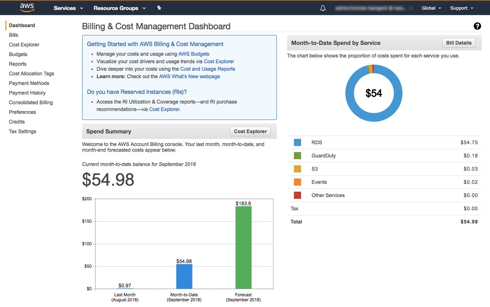

***Billing & Cost Management Dashboard*** 

It's recommended to analyze AWS cloud usage on monthly or quartely basis to find unexpected patterns, forecast future usage and analyze possible improvements. 

You can find your month-to-date costs on **Billing & Cost Management Dashboard page.** 

To enable detailed cost analysis you need to start by tagging. **Cost allocation tags**  are keys and values you can set to all of your AWS resources in order to enable slicing and dicing the cost later on. While some of those tags are automatic, the usage of **User-Defined tags**  is the focal point here. 

The following tags can be utilized as a starting point: *ApplicationName, ServiceName, DatabaseName*, ... Eventually, we will group those tags in logical ways for different types of reports. 

**Note:** Cost Allocation tags should be activated. Activating tags for cost allocation tells AWS that the associated cost data for these tags should be made available throughout the billing data pipeline. Once activated, cost allocation tags can be used as a filtering and grouping dimension in AWS Cost Explorer, as a filtering dimension in AWS Budgets, and as a dedicated column in the AWS Cost & Usage Report. 

***Cost Explorer*** 

Cost explorer allows you analyze different applications, services and usage costs. Filtering by your cost allocation value and grouping by usage type and region is an insightful way of understanding your service cost. 

Within the cost explorer you will find other helpful tools, including reports on **Reserved Instances coverage and utilization**. Reserved Instances are a great way to save costs on EC2 instances second only to Spot Instances. If utilizing on-demand EC2 Instances and forecasting that you will continue to use them in the next year, Reserved Instances is the way to go. The coverage report can tell you how much of your on-demand workload is covered by Reserved Instances hours, while the utilization report will tell you how much of your Reserved Instances hours are being utilized by on-demand instances. Combining the two reports, will provide insights about which instance types you should purchase. 

