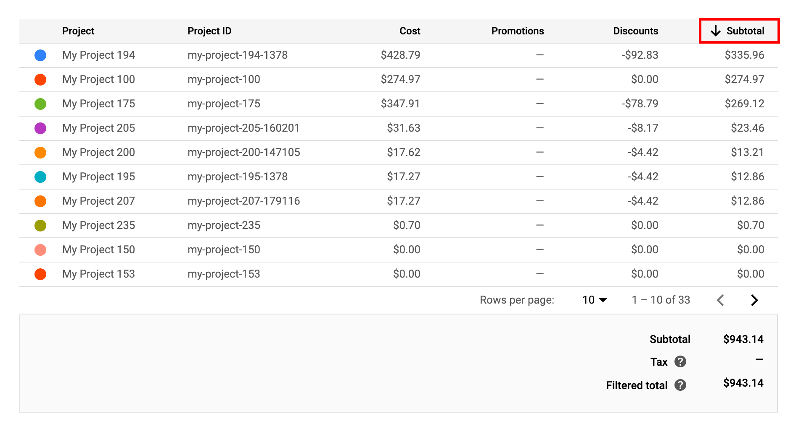
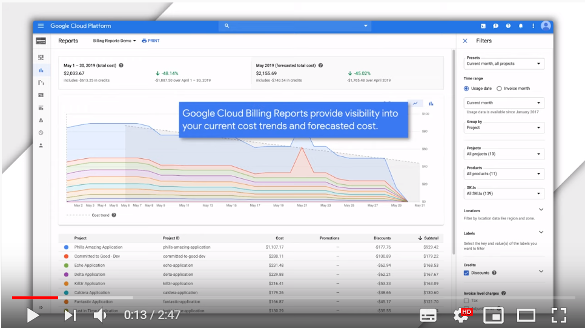
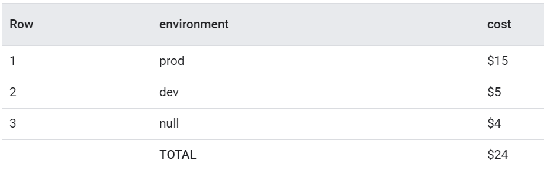

***Cloud Billing Reports***

The Cloud Billing Reports page lets you view your Google Cloud (Google Cloud) usage costs at a glance and discover and analyze trends. The Reports page displays a chart that plots usage costs for all projects linked to a Cloud Billing Account. To help you view the cost trends that are important to you, you can select a data range, specify a time range, configure the chart filters, and group by project, product, SKU, or location.

Cloud Billing reports can help you answer questions like these:

- How is my current month's Google Cloud spending trending? 
- What Google Cloud project cost the most last month? 
- What Google Cloud product (for example, Compute Engine or Cloud Storage) cost me the most? 
- What are my forecasted future costs based on historical trends? 
- How much am I spending by region? 
- What was the cost of resources with label X?

*You can find more info on the Cloud Billing Report here: https://cloud.google.com/billing/docs/how-to/reports* 

***Usage data analysis with BigQuery***
Cloud Billing export to BigQuery enables you to export detailed Google Cloud billing data (such as usage and cost estimate data) automatically throughout the day to a BigQuery dataset that you specify. Then you can access your Cloud Billing data from BigQuery for SQL query and detailed analysis, or use a tool like Google Data Studio to visualize your data. 

*You can find more info on the Cloud Billing data analysis with BigQuery here:* 
- *https://cloud.google.com/billing/docs/how-to/export-data-bigquery*
- *https://cloud.google.com/billing/docs/how-to/bq-examples* 
