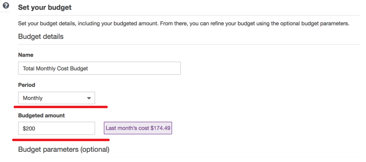
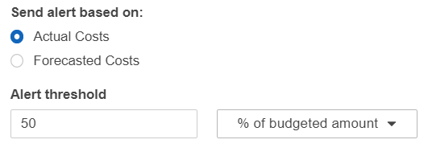

### AWS Budgets 

To control your AWS spendings you can set up   a cost budget and alarms in the AWS Billing Console using AWS Budgets. 

It is a best practice to create a total monthly cost budget for each AWS account that you use. 

You can create up to 62 budget days per month using the AWS Budgets service within the Free Tier limit. After that, you simply pay as you go to create additional budgets. 

To start you select Budget AWS service and select Create New Budget. 

You should specify your budget period and total budget:
 

and then define budget related alerts. As a start you can define alerts for 50%, 75% and 90% budget consumption: 

You can find more info on budget alerts: https://aws.amazon.com/blogs/aws-cost-management/getting-started-with-aws-budgets/

