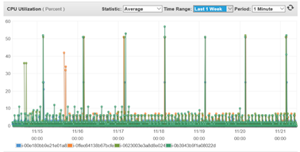

The following sections describe options of usage optimization for different AWS infrastructure components. It's recommended to start from identification and usage optimization for the services with greatest contribution into infrastrucure cost.
Generally, non-production environments shouldn’t be available 24x7, multi-availability zone configurations and matching instance configurations shouldn't be utilized across all production and non-production environments.  

## EC2 ##
EC2 configuration should be tailored based on environment purpose and workload patterns. 
Consider:
- Automation of instance starting and stopping for instances with periodic loads, e.g. cap-document-sync, doc-transformation-service, cpa-orchestrator, feature-generation-service, etc. 
Below is the typical CPU utilization pattern for these services:

- Implementation of EC2 instances stopping for non-working hours (Friday 23:00 EST – Sunday 21:00 EST) for DEV and TEST environments.
- Utilization of T3 burstable instances for DEV and TEST environments.
- Utilization of AWS Savings plan

### EC2 ALB ###
If your application leverages microservices architecture and uses ALBs to load balance a service traffic between service instances consider utilization of separate ALBs only for critical microservices which require region failover. The others can register listeners with different ports on the single ALB instance.
https://docs.aws.amazon.com/elasticloadbalancing/latest/application/tutorial-load-balancer-routing.html 

## RDS ##
