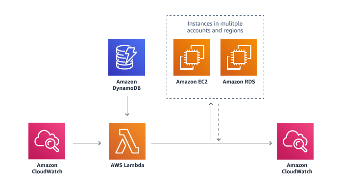

The following sections describe options of usage optimization for different AWS infrastructure components. It's recommended to start from identification and usage optimization for the services with greatest contribution into infrastrucure cost.
Generally, non-production environments shouldn’t be available 24x7, multi-availability zone configurations and matching instance configurations shouldn't be utilized across all production and non-production environments.  

## EC2 ##
EC2 configuration should be tailored based on environment purpose and workload patterns. 
Consider:
- Automation of instance starting and stopping for instances with periodic loads. 
Below is the typical CPU utilization pattern for this load pattern:

- Implementation of EC2 instances stopping for non-working hours (nights and weekends) for DEV and TEST environments.
- Utilization of T3 burstable instances for DEV and TEST environments.
- Utilization of the reserved instances
- Utilization of the spot instances
- Utilization of AWS Savings plan

***AWS Instance Scheduler***

The AWS Instance Scheduler is a simple AWS-provided solution that enables customers to easily configure custom start and stop schedules for their Amazon Elastic Compute Cloud (Amazon EC2) and Amazon Relational Database Service (Amazon RDS) instances. The solution is easy to deploy and can help reduce operational costs for both development and production environments. Customers who use this solution to run instances during regular business hours can save up to 70% compared to running those instances 24 hours a day. 

**AWS Instance Scheduler architecture** 
An Amazon CloudWatch event triggers an AWS Lambda function that checks the current state of each appropriately tagged instance against the targeted state defined in an associated schedule in Amazon DynamoDB. Then, the Lambda function applies the applicable start or stop action to the instance. 
The Lambda function also records the name of the schedule, the number of instances associated with that schedule, and the number of running instances as an optional custom metric in Amazon CloudWatch. 

### EC2 ALB ###
If your application leverages microservices architecture and uses ALBs to load balance a service traffic between service instances consider utilization of separate ALBs only for critical microservices which require region failover. The others can register listeners with different ports on the single ALB instance.
https://docs.aws.amazon.com/elasticloadbalancing/latest/application/tutorial-load-balancer-routing.html 

## RDS ##
Consider the following ways to optimize AWS RDS usage:
-	Implementation of RDS instances stopping for non-working hours (nights and weekends) for DEV and TEST environments.
-	Automation of RDS instances starting and stopping for instances with periodic load pattern for DEV and TEST environments.
-	Removal of Multi-AZ for Dev and Test environments.
-	Utilization of AWS Aurora Serverless for non-production environments for microservices that doesn’t require multi region availability.

## ElasticSearch ##
Consider the following ways to optimize AWS ElasticSearch usage:
- Utilization of less costly instance type for dev and test environments
- Utilization of single or no-managed master nodes for non-production environments 
- Utilization of single non-prod cluster for all non-prod environments with separate index for each environment.

