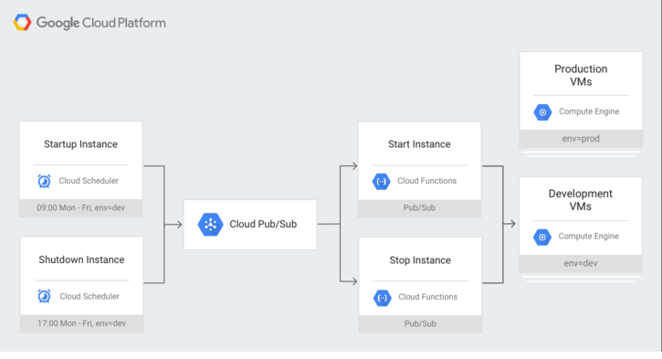

The following sections describe options of usage optimization for different GCP infrastructure components. It's recommended to start from identification and usage optimization for the services with greatest contribution into infrastrucure cost.
Generally, non-production environments shouldn’t be available 24x7, multi-availability zone configurations and matching instance configurations shouldn't be utilized across all production and non-production environments.

## Compute Engine ##
Compute Engine configuration should be tailored based on environment purpose and workload patterns. 
Consider:
- Automation of instance starting and stopping for instances with periodic loads

- Implementation of Compute Engine instances stopping for non-working hours (nights and weekends) for DEV and TEST environments.
- Utilization of the commited instances
- Utilization of the preemtible instances

***Cloud Scheduler for starting/stoping instances*** 

With Cloud Scheduler you set up scheduled units of work to be executed at defined times or regular intervals. 

