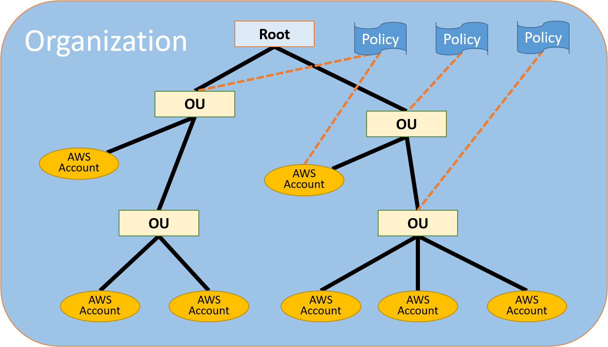

To separate production and development environments in AWS cloud you can use **Organization** and **Account**  entities: 

- One account for the **Production** environment with very strict IAM access permissions 

- One account for all **Development** environments (Dev, Test, Perf, Integration) 

- You can consider separate CI/CD tools account with access restricted to DevOps team and deployment rights to **Production** and **Development**  environments 

It's recommended to setup cost budget for each account. See <Pattern: AWS Cost Budget> 

### Control resource usage with Service Control Policies (SCP) 

You can define and associate SCP with your Development accounts to control which services or  particular resources can be used.

 It's recommended to limit access for development accounts to only required services and then narrow them down to resources based on tags.

The tags can be defined in your IaC scripts. 
